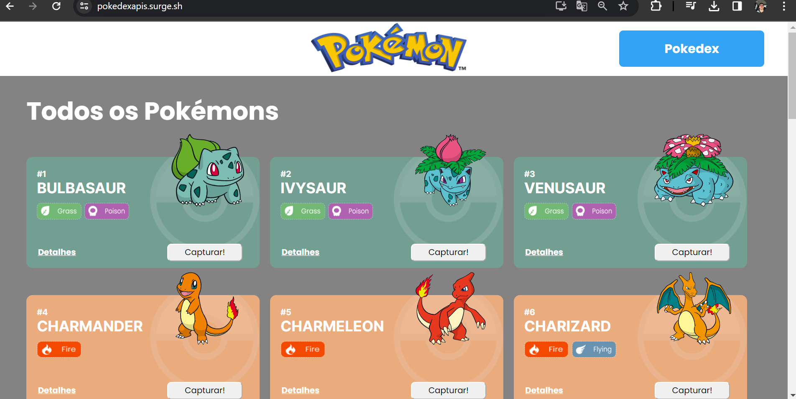
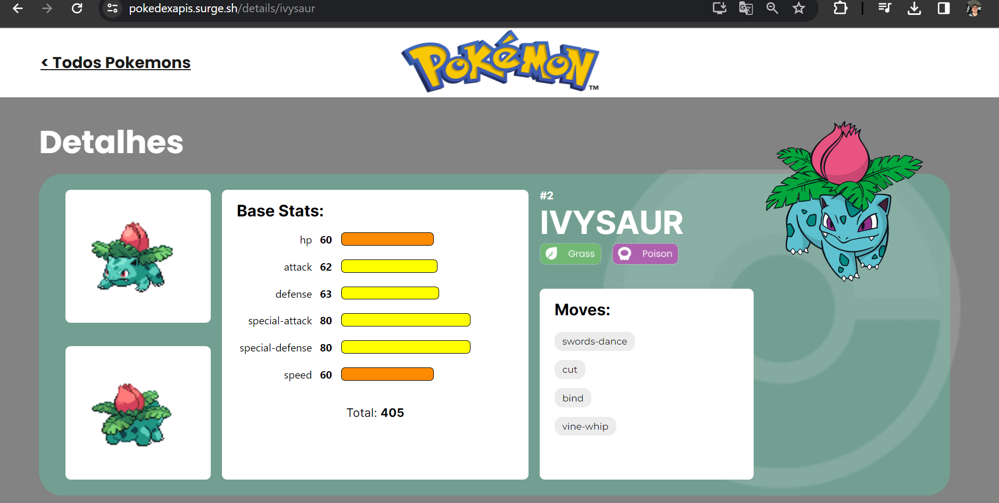
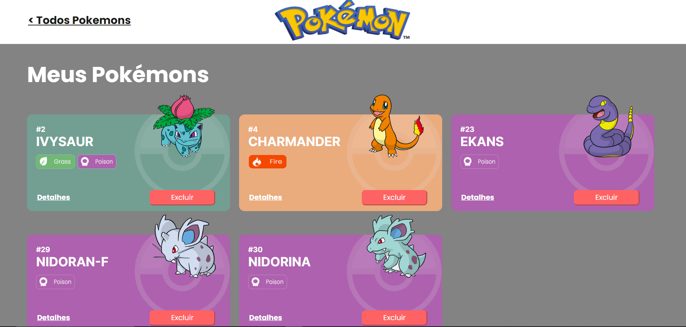

# Pokedex

## 📖 Introdução 

A Pokedex é uma aplicação web que contém as principais informações dos primeiros 600 pokemons, como: nome, tipo, movimentos, entre outros, puxando esses dados da API [PokeApi](https://pokeapi.co/).

## 🔗Link de Acesso
- Deploy Surge: [Clique aqui!](https://pokedexapis.surge.sh/).

## 🧭Status do Projeto
- ⏳Concluido.

### Instalando
```bash
# Instalando dependências
npm install

# executando o projeto
npm start
```

### Layout (HomePage)

| <br> |
| :---: |

### Layout (Detalhes)

| <br> |
| :---: |

### Layout (Pokemons capturados)

| <br> |
| :---: |

### Funcionalidades
```bash
. Listagem: Listagem dos 600 primeiros pokemons existentes, organizados por página (30 em cada);
. Filtro: Filtrar pokemon pelo nome;
. Detalhes: Cada card contém um botão para exibir especificidades como Base Stats (estatisticas) e Movimentos ao ser clicado;
. Captura: Adicionar pokemons a sua Pokedex pessoal;
. Excluir: Excluir pokemons da Pokedex e mandar de volta para a página principal;
. Troca de página: Opção de passar página para exibir os próximos 30 pokemons;
```

### Bibliotecas Utilizadas

```bash
styled-components
axios
react-router-dom
```

## 💡IDE utilizada:
- VSCode

## 💻Tecnologias 


## 📫 Contato

E-mail: jpbecker20@gmail.com

WhatsApp: +5548999666847
